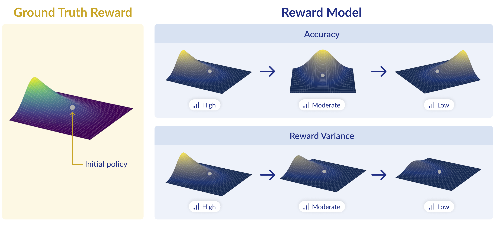

# What Makes a Reward Model a Good Teacher? An Optimization Perspective

[[Paper](https://arxiv.org/abs/2503.15477)]

Official implementation based on the [PyTorch](https://pytorch.org/) and [Hugging Face TRL](https://huggingface.co/docs/trl/en/index)
libraries.

<p align="center">
  
</p>

## Table of Contents

- [Installation](#Installation)
- [Relabeling and Splitting UltraFeedback Using Ground Truth Reward Model](#relabeling-and-splitting-ultrafeedback-using-a-ground-truth-reward-model)
- [More Accurate Reward Models Are Not Necessarily Better Teachers (Section 4.1)](#more-accurate-reward-models-are-not-necessarily-better-teachers-section-41)
- [For Different Language Models, Different Reward Models Are Better (Section 4.2)](#for-different-language-models-different-reward-models-are-better-section-42)

## Installation
1. Create and activate a virtual environment. For example, using Conda: ```conda create -n MY_ENV python=3.12 && conda activate MY_ENV```.
2. Install PyTorch (see this [link](https://pytorch.org/get-started/locally/#start-locally) for best practices). Our experiments were ran with version 2.5.1.
3. Run ```pip install .```.
4. [Optional] If you want to use flash attention, follow the instructions [here](https://github.com/Dao-AILab/flash-attention/blob/main/README.md).


## Relabeling and Splitting UltraFeedback Using a Ground Truth Reward Model
In the experiments of Sections 4.1 and 4.2, we use the [ArmoRM-Llama3-8B-v0.1](https://huggingface.co/RLHFlow/ArmoRM-Llama3-8B-v0.1) reward model as the ground truth reward. 
We relabel preferences in the UltraFeedback dataset according to this ground truth reward and create three splits: reward model training split (80% of original training set), policy gradient training split (20% of the original training set), and test split (original test split).

<details>
<summary><strong>Command for relabeling and splitting UltraFeedback using a single GPU:</strong></summary>

```sh
python src/main_data.py --config src/experiments_configs/pref_data/pref_data_relabel_uf_config.yaml
```
The generated dataset will be saved under the directory specified in the configuration file. Default is: ```data_files/uf_armorm_relabeled```.
</details>

## More Accurate Reward Models Are Not Necessarily Better Teachers (Section 4.1)

### 1. Supervised Finetuning (SFT)
SFT the pretrained Pythia-2.8B language model on AlpacaFarm using the following [configuration file](./src/experiments_configs/Section4.1/sft/pythia_2-8b_sft_alpaca_config.yaml).

<details>
<summary><strong>Command for SFTing on AlpacaFarm using a single GPU:</strong></summary>

```sh
python src/main.py --config src/experiments_configs/Section4.1/sft/pythia_2-8b_sft_alpaca_config.yaml
```
The resulting TensorBoard logs and model checkpoint will be created under the directory specified in the configuration file. Default is: ```outputs/sft/pythia_2-8b_alpaca```.
</details>

### 2. Generating On-Policy Responses for UltraFeedback
Generate on-policy responses (sampled from the initial policy) for reward model training using the following [configuration file](./src/experiments_configs/Section4.1/pref_data/pref_data_pythia_2-8b_alpaca_sft_onpolicy_relabel_uf_config.yaml).
Make sure to:
- Set the ```language_model_path``` configuration to the path of the SFT model trained in [step 1](#1-supervised-finetuning-sft).

<details>
<summary><strong>Command for generating online data and relabeling using a single GPU:</strong></summary>

```sh
python src/main_data.py --config src/experiments_configs/Section4.1/pref_data/pref_data_pythia_2-8b_alpaca_sft_onpolicy_relabel_uf_config.yaml
```
The generated dataset will be saved under the directory specified in the configuration file. Default is: ```data_files/uf_armorm_relabeled_pythia2-8b_sft_alpaca```.
</details>

### 3. Reward Model Training
Using the off-policy UltraFeedback responses and on-policy responses generated in [step 2](#2-generating-on-policy-responses-for-ultrafeedback), we train five reward models on different mixes of on-policy and off-policy responses (100%, 75%, 50%, 25%, or 0% on-policy).
The configuration files for reward model training can be found [here](./src/experiments_configs/Section4.1/rm_train/).
In each configuration file, make sure to:
- Set the ```dataset_path``` configuration to the dataset with on-policy responses generated in [step 2](#2-generating-on-policy-responses-for-ultrafeedback).
- Set the ```second_dataset_path``` configuration to the dataset with original UltraFeedback responses generated in [the preliminary data preparation step](#relabeling-and-splitting-UltraFeedback-using-a-ground-truth-reward-model).
- Set the ```pretrained_model_path``` configuration to the path of the SFT model trained in [step 1](#1-supervised-finetuning-sft).

<details>
<summary><strong>Command for training your reward model on 25% of off-policy responses and 75% of on-policy responses, using a single GPU:</strong></summary>

```sh
python src/main.py --config src/experiments_configs/Section4.1/rm_train/pythia_2-8b_rm_train_75p_config.yaml
```
The resulting TensorBoard logs and reward model checkpoint will be created under the directory specified in the configuration file. Default is: ```outputs/rm/pythia2-8b_alpaca```.
</details>


### 4. Reward Model Evaluation
We evaluate the reward models and compute statistics for reward normalization during policy gradient using [this configuration file](./src/experiments_configs/Section4.1/rm_eval/pythia_2-8b_sft_alpaca_rm_eval_config.yaml).
Make sure to:
- Set the ```dataset_path``` configuration to the relabeled UltraFeedback dataset generated in [the preliminary data preparation step](#relabeling-and-splitting-UltraFeedback-using-a-ground-truth-reward-model).
- Set the ```language_model_path``` configuration to the path of the SFT model trained in [step 1](#1-supervised-finetuning-sft).
- Set the ```proxy_reward_models``` configuration to the paths of the reward models trained in [step 3](#3-reward-model-training).

<details>
<summary><strong>Command for reward model evaluation step using a single GPU:</strong></summary>

```sh
python src/main.py --config src/experiments_configs/Section4.1/rm_eval/pythia_2-8b_sft_alpaca_rm_eval_config.yaml
```
The evaluation results will be saved under the directory specified in the configuration file. Default is: ```outputs/rm_eval/pythia2-8b_alpaca```.
</details>


### 5. Policy Gradient
For running policy gradient (RLOO by default) with one of the reward models trained in [step 3](#3-reward-model-training) use [this configuration file](./src/experiments_configs/Section4.1/pg/pythia_2-8b_rloo_alpaca_sft_config.yaml), and for running policy gradient directly with the ground truth reward use [this configuration file](./src/experiments_configs/Section4.1/pg/pythia_2-8b_rloo_alpaca_sft_ground_truth_reward_config.yaml).
Make sure to:
- Set the ```dataset_path``` configuration to the relabeled UltraFeedback dataset generated in [the preliminary data preparation step](#relabeling-and-splitting-UltraFeedback-using-a-ground-truth-reward-model).
- Set the ```reward_model_path``` configuration to one of the reward models trained in [step 3](#3-reward-model-training). If you decide to use our ground truth reward model, relevant configuration already has the correct reward model.
- Set the ```path_to_precomputed_rewards_for_normalization``` configuration to the path to the .pt file corresponding to the rewards computed in [step 4](#4-reward-model-evaluation) over the training set. Specifically, the file name should start with ```per_prompt_rewards_```, contain the name of the relevant reward model, and end with ```train_rlhf_prefs.pt```.
- Set the ```language_model_path``` configuration to the path of the SFT model trained in [step 1](#1-supervised-finetuning-sft).

<details>
<summary><strong>Command for running policy gradient using accelerate on 2 GPUs:</strong></summary>

```sh
accelerate launch --num_processes 2 --num_machines 1 --config_file src/accelerate_configs/deepspeed3.yaml src/main.py src/main.py --config src/experiments_configs/Section4.2/pg/llama_1b_rloo_uf_sft_config.yaml
```
The resulting TensorBoard logs and checkpoints will be saved under the directory specified in the configuration file. Default is ```outputs/rloo/pythia2-8b_alpaca``` or ```outputs/rloo/pythia2-8b_alpaca_gt``` (depending on whether the configuration for a trained reward model or the ground truth reward is used).

Note that:
- You can evaluate the final policy right after policy gradient by setting the ```eval_final_policy_at_end``` configuration to true.
- You can evaluate intermediate checkpoints and/or the final policy by following [step 4](#4-reward-model-evaluation); make sure to replace ```language_model_path``` by your checkpoint path.
- You can downscale the rewards for a fraction of prompts in the training set through the ```reward_scale_factor``` and ```scale_reward_for_frac_prompts``` configurations.
- You can get more details about the available configuration options in the [arguments classes](./src/what_makes_good_rm/Arguments/args.py).
</details>

## For Different Language Models, Different Reward Models Are Better (Section 4.2)

### 1. Supervised Finetuning (SFT)
To SFT the pretrained Llama-3.2-1B and Pythia-1B language models on the relabeled UltraFeedback dataset (see [initial relabeling step](#relabeling-and-splitting-UltraFeedback-dataset-using-ground-truth-reward-model)), use their respective [configuration files](./src/experiments_configs/Section4.2/sft/).
Make sure to:
- Set the ```dataset_path``` configuration to the relabeled UltraFeedback dataset generated in [the preliminary data preparation step](#relabeling-and-splitting-UltraFeedback-using-a-ground-truth-reward-model).

<details>
<summary><strong>Command for SFTing Pythia-1B on relabeled UltraFeedback using a single GPU:</strong></summary>

```sh
python src/main.py --config src/experiments_configs/Section4.2/sft/pythia_1b_sft_uf_config.yaml
```
The resulting TensorBoard logs and model checkpoint will be created under the directory specified in the configuration file. Default is: ```outputs/sft/pythia1b_uf```.
</details>

<details>
<summary><strong>Command for SFTing Llama-3.2-1B on relabeled UltraFeedback using a single GPU:</strong></summary>

```sh
python src/main.py --config src/experiments_configs/Section4.2/sft/llama_1b_sft_uf_config.yaml
```
The resulting TensorBoard logs and model checkpoint will be created under the directory specified in the configuration file. Default is: ```outputs/sft/llama1b_uf```.
</details>


### 2. Reward Model Evaluation
To evaluate the considered publicly available reward models and compute statistics for reward normalization during policy gradient, we use [these configuration files](./src/experiments_configs/Section4.2/rm_eval/).
Make sure to:
- Set the ```dataset_path``` configuration to the relabeled UltraFeedback dataset generated in [the preliminary data preparation step](#relabeling-and-splitting-UltraFeedback-using-a-ground-truth-reward-model).
- Set the ```language_model_path``` configuration to the language model of choice.

<details>
<summary><strong>Command for reward model evaluation using Pythia-1B SFT on a single GPU:</strong></summary>

```sh
python src/main.py --config src/experiments_configs/Section4.2/rm_eval/pythia_1b_sft_uf_open_rms_eval_config.yaml
```
The evaluation results will be saved under the directory specified in the configuration file. Default is: ```outputs/open_rms_eval/pythia1b_uf```.
</details>

<details>
<summary><strong>Command for reward model evaluation using Llama-3.2-1B SFT on a single GPU:</strong></summary>

```sh
python src/main.py --config src/experiments_configs/Section4.2/rm_eval/llama_1b_sft_uf_open_rms_eval_config.yaml
```
The evaluation results will be saved under the directory specified in the configuration file. Default is: ```outputs/open_rms_eval/llama1b_uf```.
</details>

<details>
<summary><strong>Command for reward model evaluation using Llama-3.2-1B-Instruct on a single GPU:</strong></summary>

```sh
python src/main.py --config src/experiments_configs/Section4.2/rm_eval/llama_1b_instruct_open_rms_eval_config.yaml
```
The evaluation results will be saved under the directory specified in the configuration file. Default is: ```outputs/open_rms_eval/llama1b_instruct```.
</details>

### 3. Policy Gradient 
For running policy gradient (RLOO by default) use [these configuration files](./src/experiments_configs/Section4.2/pg/).
Make sure to:
- Set the ```dataset_path``` configuration to the relabeled UltraFeedback dataset generated in [the preliminary data preparation step](#relabeling-and-splitting-UltraFeedback-using-a-ground-truth-reward-model).
- Set the ```reward_model_path``` configuration.
- Set the ```path_to_precomputed_rewards_for_normalization``` configuration to the path to the .pt file corresponding to the rewards computed in [step 2](#2-reward-model-evaluation) over the training set. Specifically, the file name should start with ```per_prompt_rewards_```, contain the name of the relevant reward model, and end with ```train_rlhf_prefs.pt```.
- Set the ```language_model_path``` configuration to the relevant language model.

<details>
<summary><strong>Command for running policy gradient using Pythia-1B SFT on 2 GPUs:</strong></summary>

```sh
accelerate launch --num_processes 2 --num_machines 1 --config_file src/accelerate_configs/deepspeed3.yaml src/main.py src/main.py --config src/experiments_configs/Section4.2/pg/pythia_1b_rloo_uf_sft_config.yaml
```
The resulting TensorBoard logs and checkpoints will be saved under the directory specified in the configuration file. Default is: ```outputs/rloo_open_rms/pythia1b_uf```.
</details>

<details>
<summary><strong>Command for running policy gradient using Llama-3.2-1B SFT on 2 GPUs:</strong></summary>


```sh
accelerate launch --num_processes 2 --num_machines 1 --config_file src/accelerate_configs/deepspeed3.yaml src/main.py src/main.py --config src/experiments_configs/Section4.2/pg/llama_1b_rloo_uf_sft_config.yaml
```
The resulting TensorBoard logs and checkpoints will be saved under the directory specified in the configuration file. Default is: ```outputs/rloo_open_rms/llama1b_uf```.
</details>

<details>
<summary><strong>Command for running policy gradient using Llama-3.2-1B-Instruct on 2 GPUs:</strong></summary>

```sh
accelerate launch --num_processes 2 --num_machines 1 --config_file src/accelerate_configs/deepspeed3.yaml src/main.py src/main.py --config src/experiments_configs/Section4.2/pg/llama_1b_instruct_rloo_config.yaml
```
The resulting TensorBoard logs and checkpoints will be saved under the directory specified in the configuration file. Default is: ```outputs/rloo_open_rms/llama1b_instruct```.
</details>


## Citation
For citing the paper you can use:
```bibtex
@article{razin2025what,
  title={What Makes a Reward Model a Good Teacher? An Optimization Perspective},
  author={Razin, Noam and Wang, Zixuan and Strauss, Hubert and Wei, Stanley and Lee, Jason D and Arora, Sanjeev},
  journal={arXiv preprint arXiv:2503.15477},
  year={2025}
}
```
